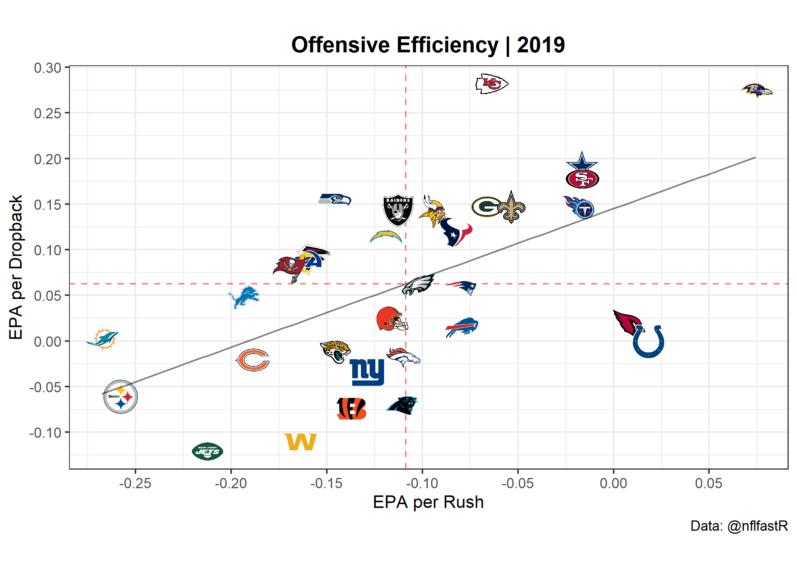
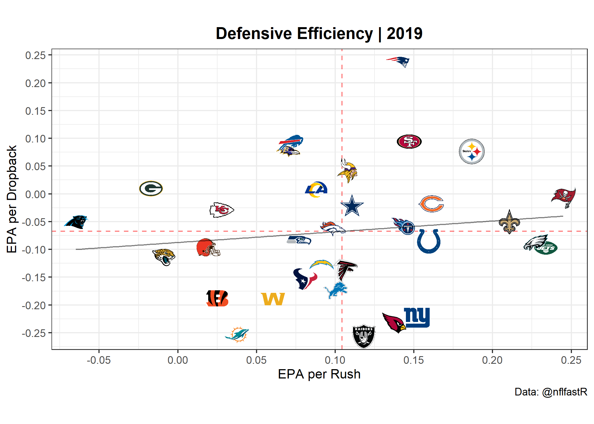
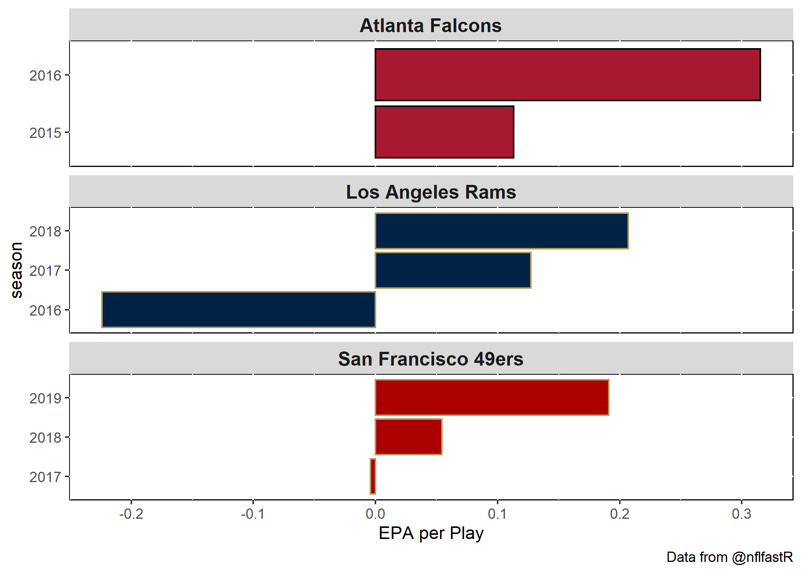
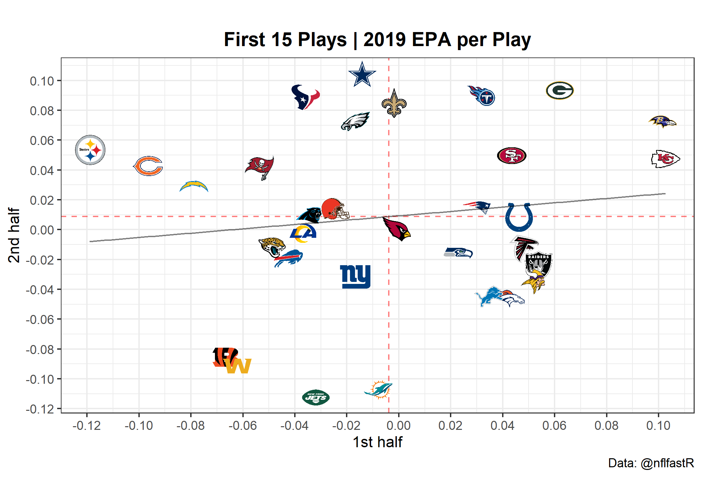
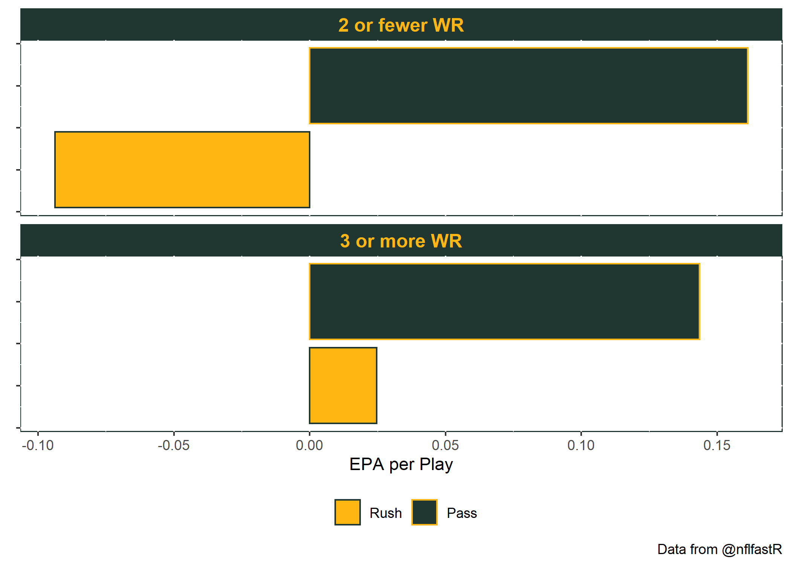
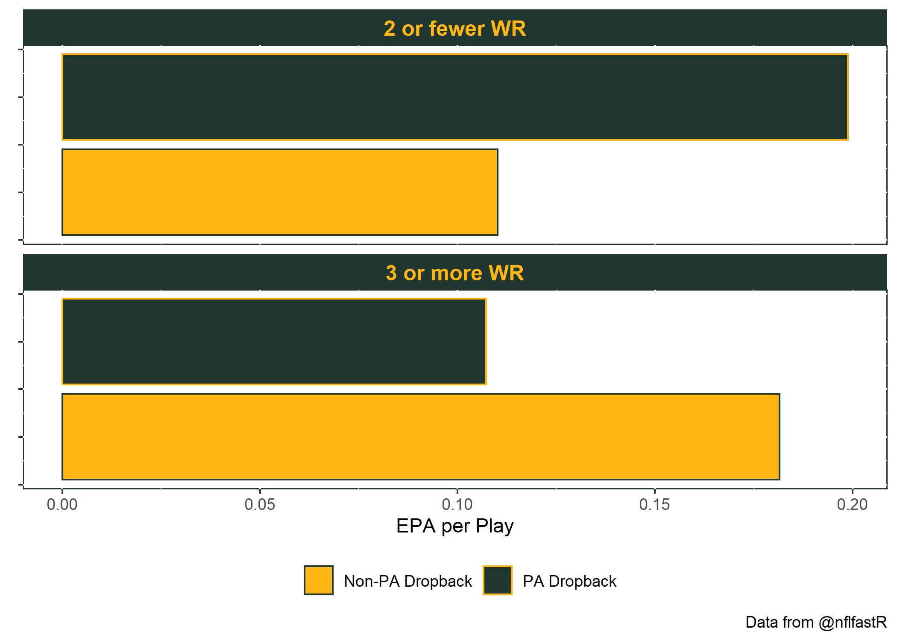
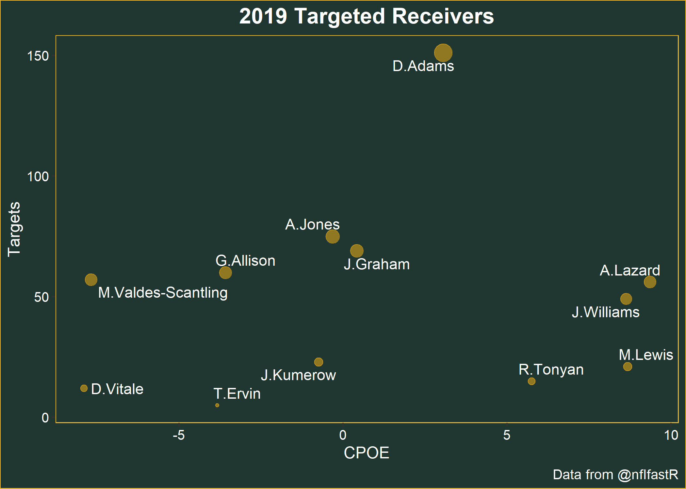
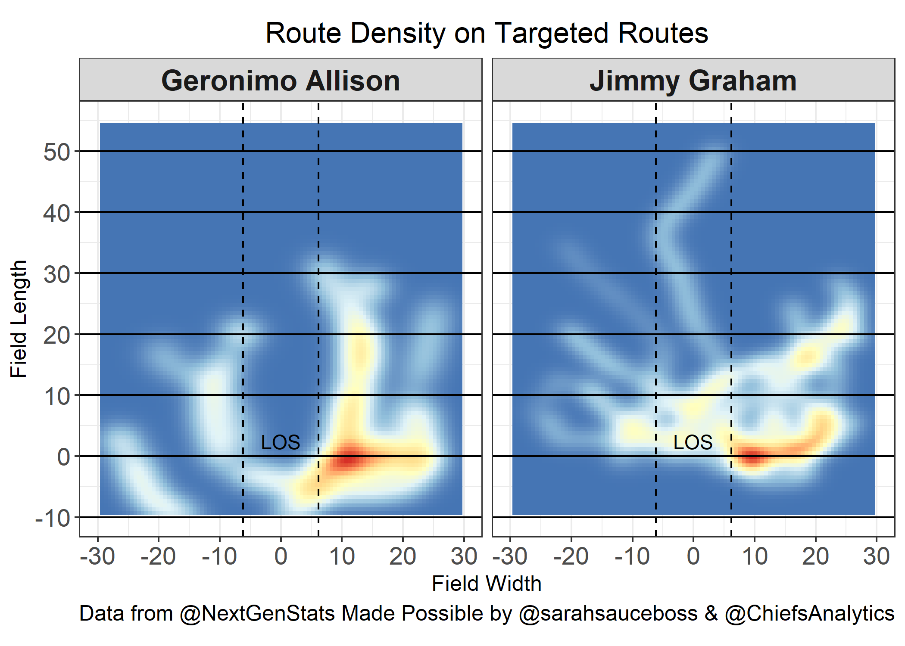

## 2019 Review / 2020 Preview

#### 2019 Offensive Efficiency
Green Bay was the 7th most efficient offense in terms of expected points added per play in 2019. The passing offense was the 8th highest rated while rushing was the 9th highest. 

<!-- -->

#### 2019 Defensive Efficiency 
Defensively, Green Bay finished in the middle of the pack in terms of expected points allowed per play. They finished 7th against the pass but 31st against the run. 

<!-- -->

#### 2020 Regression
In 2020 the number 1 seed is more important than ever. Seven teams will make the playoffs from each conference and only one team from each side will earn a first-round bye. In order for Green Bay to be in contention for the 1 seed they will likely need to win 13 games again.

The offensive efficiency metrics we saw are respectable for the first year of the Matt LaFleur era. The defensive efficiency metrics are fine. Being better against the pass is much more important than the run. However, these are not elite level efficiency numbers you typically see from 13 win teams that make it to the conference championship. 

[Earlier this summer](https://www.opensourcefootball.com/posts/2020-08-23-exploring-wins-with-nflfastr/) I used expected points added per play metrics to develop an expected wins metric. Using this methodology I found Green Bay overperformed their expected wins by 2.8 wins, the most of any team in 2019, and the 13th most since 1999. There were 25 teams who over performed by more than 2.5 wins from 1999 to 2018 and those teams lost 2.3 games more in the next season. 

Additionally, the Packers were 8-1 in games decided by eight points or less. [Football Outsiders pythagorean wins](https://en.wikipedia.org/wiki/Pythagorean_expectation#:~:text=The%20formula%20is%20used%20with,referred%20to%20as%20Pythagorean%20wins.) uses a teams points for and points against to develop an expected number of wins. With a regular season point differential of +63 points he 2019 Packers outperformed their pythagorean wins expectation by 3.3 wins. This is the 3rd most ever in the nflfastR library that dates back to 1999. Additionally, the team they beat to get to the conference championship produced a season long point differential of +7 points and outperformed their pythagorean wins by 2.8 which is the 11th most since 1999.

In order for the Packers to come out as a team with 13 expected wins in the type of model I used there has to be some significant improvements in 2020. A top 7 passing offense sounds nice but in 2020 the passing offense was more similar to the 18th through 20th ranked Browns, Cardinals, and Bills than it was to the top ranked Chiefs and Ravens. Holding all else equal the passing offense would have to jump to the Chiefs/Ravens level to grade out as a 13 expected win team. This is quite the leap forward, however, we have seen significant improvements in early years of previous Shanahan, McVay, and LaFleur offenses. 

<!-- -->
Another path to a 13 win season is one where the defense makes a significant jump forward. The team with the previous record for lowest point differential in a 13 win season was the 1999 Titans who won 13 games with a point differential of 68 points (five more points than the 2019 Packers). After adding Javon Kearse they finished as the 16th best passing defense since 1999 in terms of expected points allowed per play and won 13 games again in 2000. In order for the Packers to be a 13 win team in 2020 with no offensive imporovement the defense will need to be as good as the 2009 Rex Ryan and Darrelle Revis lead Jets squad that Mike Pettine was a part of. 

#### First 15 Plays

This could very well be nothing but the Green Bay offense was at its best in the first 15 plays of each half. Or maybe LaFleur is a master at planning these plays. 
<!-- -->

#### EPA by Personnel
The Packers were more efficient running out of personnel sets with three or more wide receivers in 2019. Passing efficiency was slightly better with two or fewer wide receivers although the difference was negligible.

<!-- -->

Overall passing efficiency out of heavier personnel was similar to 11 personnel. However, the play-action game was much more effective out of heavier personnel.A fair amount of the Packer successful shot plays came from play-action dropbacks with two or fewer wide receivers. Green bay ran play-action 28% of the time in sets with two or fewer receivers as opposed to 12% of the time with three or more wideouts.

<!-- -->

#### Top Plays
You may have heard the Packers did not add any receivers in the 2020 NFL Draft. Instead they opted to draft a running back in the 2nd and a full back / tight end in the 3rd. As a result we should expect the Packers to run less 11 personnel and more heavier sets in 2020. On a positive note, play-action dropbacks from heavier personnel were some of the Packers most efficient plays in 2019. Here are some of the top 2019 play-action dropbacks from two or fewer wide receiver sets.

#### Receiving Corps Changes

<!-- -->
Jimmy Graham and Geronimo Allison earned over 20% of the targets in 2019. They leave behind over 120 vacated. We can see below that passes thrown Graham and Allison weren't completed at a rate any more frequently than we would expect given the down, distance, air yards, and pass location. Some combination of Allen Lazard, Marques Valdes-Scantling, and Tyler Ervin will likely absorb Allisons targets in 2020. In 2019 passes thrown to Lazard were completed about 9% more frequently than we would expect given while passes thrown to MVS were completed about 8% less frequently than we would expect. 

We haven't got to see much from Jace Sternberger yet. Sternberger went one spot ahead of Terry McLaurin in the 2019 draft and could inherit a good portion of Graham's targets in 2020 along with Robert Tonyan. Ahead of the 2019 NFL Draft Greg Cosell surprised me when he seemed to like Sternberger just as much as the top two tight end prospects, TJ Hockenson and Noah Fant. On the Ross Tucker Football Podcast Cosell said Sternberger had similarities to Travis Kelce in terms of receiving movement for a tight end and is someone who can impact the passing game from multiple formation locations and is just scratching the surface of what he can do as a dynamic weapon. 

<!-- -->
